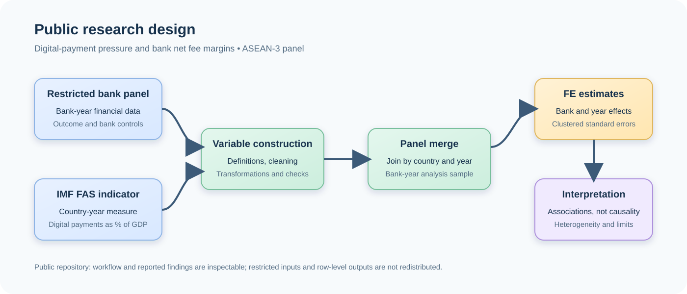

# Digital Payment Pressure and Bank Net Fee Margins

## Evidence from an ASEAN-3 Bank Panel

> **Public research report**
> This report documents an undergraduate accounting and finance research project. It reports the study design, results, and limitations, but does not distribute restricted bank data, derived datasets, or course-submission files.

## Abstract

This study examines whether digital-payment activity is associated with bank net fee margins in Indonesia, Malaysia, and Thailand. It combines a restricted bank-level financial panel with a country-year indicator from the IMF Financial Access Survey (FAS): mobile and internet banking transactions as a percentage of GDP. The final sample contains 344 bank-year observations from 39 banks over 2014–2022. Fixed-effects panel regressions indicate limited evidence of a direct linear association after controls, while a logarithmic specification identifies a negative and statistically significant pooled association. However, country subsamples are heterogeneous, and diagnostic decomposition suggests that cross-country structural differences may contribute materially to the pooled result. The evidence is therefore descriptive and conditional rather than causal. The study motivates further work using richer income disaggregation, broader country coverage, and research designs that can more clearly identify changes in digital-payment competition.

## 1. Research question

> **Is digital-payment pressure associated with bank net fee margins in Indonesia, Malaysia, and Thailand?**

The study focuses on the relationship between the growth of digital payment activity and bank fee-based income. It does not assume that the relationship must be positive or negative. Digital payments may create transaction volume, merchant-service opportunities, and deeper customer engagement. At the same time, payment platforms and new providers may increase price competition for established payment services or displace traditional fee streams.

The final analysis covers Indonesia, Malaysia, and Thailand (ASEAN-3). The research was initially designed around ASEAN-5, but the selected digital-payment indicator did not have sufficiently consistent coverage for the Philippines and Singapore. The final sample should therefore not be described as ASEAN-5 evidence.

## 2. Motivation and conceptual framework

For banks, digitalisation can affect fee income through several channels:

- **Transaction and service expansion:** digital channels can lower friction, increase usage, and support new payment or merchant services.
- **Competitive pressure:** FinTech firms, payment networks, and digital-first competitors may compress prices or alter the allocation of payment-related revenue.
- **Customer relationships and cross-selling:** transaction data and frequent digital engagement may create opportunities for deposits, lending, insurance, or wealth-management services.
- **Institutional and market differences:** payment infrastructure, regulation, financial inclusion, and bank business models can differ substantially across countries.

These channels imply an empirical question rather than a predetermined conclusion. A negative association between digital-payment activity and net fee margins would not, by itself, show that digital payments reduce bank income: it could reflect market composition, country-specific institutional conditions, or omitted factors that jointly vary with payment activity and bank outcomes.

## 3. Data and variable construction

### 3.1 Sample

The final thesis sample contains:

| Item | Value |
| --- | ---: |
| Countries | Indonesia, Malaysia, Thailand |
| Banks | 39 |
| Bank-year observations | 344 |
| Period | 2014–2022 |

Bank financial data were drawn from a restricted WRDS-derived panel. The project uses these data to construct bank-level financial measures and controls, including net fee margin, liquidity, loan-to-deposit ratio, and a capital-adequacy proxy. The restricted source data and the derived bank panel are not included in this public repository.

### 3.2 Digital-payment-pressure measure

The explanatory measure is the IMF Financial Access Survey indicator `IMF_FAS_FCMIBT`, expressed in `PT_GDP`: mobile and internet banking transactions as a percentage of GDP. The public scripts document how the selected indicator is retrieved, inspected, and converted to country-year form. The [variable definitions](variable-definitions.md) provide the public conceptual definitions, levels, and construction limits:

1. [Download the IMF FAS source](../src/data/download_imf_fas.py).
2. [Identify candidate indicators](../src/data/discover_fas_indicator.py).
3. [Extract the selected digital-payment measure](../src/data/extract_digital_payment_pressure.py).
4. [Merge it with the bank panel](../src/data/merge_bank_panel.py).

The country-year level of this measure is central to the study's interpretation. It varies at a broader level than an individual bank, so it cannot on its own identify a bank-specific causal effect.

### 3.3 Outcome and controls

The outcome is **net fee margin**, constructed from bank financial data as net fee income relative to total assets. The analysis also considers financial controls and alternative specifications, including bank size, capital adequacy, credit risk, interest expense, and deposit-related measures. The public code documents the precise calculation and modeling workflow, but the restricted inputs prevent a public clone from regenerating the final thesis estimates.

## 4. Research design at a glance



The diagram summarises the public-facing workflow. The bank panel remains restricted; the diagram describes its role without publishing bank identifiers or observations.

## 5. Estimation strategy

The principal specifications use panel regressions with bank and year fixed effects. The [methodology appendix](methodology-appendix.md) records the public model notation, transformations, estimation choices, and reproducibility boundaries. This design aims to separate the observed relationship from persistent bank differences and shocks common across the sample period. Standard errors are clustered at the bank level, and continuous variables are winsorised at the 1st and 99th percentiles.

The analysis assesses several related specifications:

- a scaled digital-payment measure;
- models with progressively richer financial controls;
- a logarithmic digital-payment specification;
- a nonlinear specification; and
- country-level subsample checks.

Fixed effects strengthen the descriptive comparison, but they do not alone resolve all identification concerns. In particular, the digital-payment variable is measured at the country-year level, the analysis covers only three countries, and policy, infrastructure, and market-structure differences can remain relevant.

## 6. Results

The table below reports the headline estimates disclosed in the public project documentation. All specifications use 344 observations.

| Specification | Digital-payment coefficient | Observations | Interpretation |
| --- | ---: | ---: | --- |
| Main model, scaled measure | -0.000292* | 344 | Negative association; marginal statistical evidence |
| Main model with controls | -0.000264 | 344 | Negative association; not statistically significant |
| Full controls model | -0.000208 | 344 | Negative association; not statistically significant |
| Log baseline model | -0.010171** | 344 | Negative and statistically significant pooled association |
| Nonlinear model, linear term | -0.010829** | 344 | Negative linear term; squared term not significant |

`* p < 0.10`, `** p < 0.05`.

The linear specifications provide limited evidence of a robust direct association once additional controls are included. The log baseline model produces a negative, statistically significant pooled association. Taken together, these results are consistent with the possibility that stronger digital-payment activity coincides with lower bank net fee margins in the pooled sample, but they do not establish a uniform effect across banks or countries.

## 7. Interpretation and diagnostic evidence

The country-subsample analysis does not produce a uniform pattern across Indonesia, Malaysia, and Thailand. In addition, diagnostic decomposition indicates that the pooled result may substantially reflect structural differences between countries rather than a common within-country mechanism.

This matters for interpretation. A coefficient estimated from the pooled panel can combine several sources of variation: differences in national payment systems, regulatory settings, banking-sector structure, levels of financial inclusion, and the timing of digital adoption. The study therefore treats the negative log-specification result as a finding that motivates further research, not as proof that digital payments reduce fee income for every bank or market.

A more complete account would require data that distinguish payment, card, merchant-service, and other non-interest income; more countries and years; and ideally a well-defined institutional event or policy change that supports a stronger identification design.

## 8. Limitations

The following limitations define the scope of the evidence:

1. **Association is not causation.** The results are conditional associations, not causal estimates.
2. **Country-year explanatory measure.** The digital-payment measure varies at the country-year level, while the outcome is bank-level. This restricts the available within-country variation and complicates causal interpretation.
3. **Limited country coverage.** The final sample has three countries, so results should not be generalized to ASEAN-5 or all banking markets.
4. **Potential omitted variables.** Regulatory reforms, payment infrastructure, macroeconomic conditions, market concentration, and other unobserved factors may affect both digital payments and bank fee margins.
5. **Income aggregation.** Net fee margin does not separately identify payments, cards, merchant services, wealth management, or other sources of non-interest income.
6. **Restricted data.** The underlying bank panel cannot be redistributed, so the exact thesis regressions are inspectable through their documented design and reported results but are not publicly rerunnable.

## 9. Reproducibility and data access

This repository separates **method transparency** from **data redistribution**.

| Component | Publicly reproducible? | Notes |
| --- | --- | --- |
| Synthetic fixed-effects demonstration | Yes | [The example](../examples/run_example.py) is self-contained and uses deterministic synthetic data. |
| IMF FAS retrieval and indicator extraction | Partly | The source is public, but availability and reuse terms can change; generated outputs are not committed. |
| Restricted bank-panel construction and thesis regressions | No | Required WRDS-derived inputs and derived datasets are excluded. |
| Reported thesis findings | Inspectable, not rerunnable | This report documents the final results without distributing the restricted inputs. |

To run the public demonstration:

```powershell
uv sync --group dev
uv run python examples/run_example.py
uv run pytest
```

The example illustrates the Python and `linearmodels` fixed-effects workflow. Its synthetic observations and coefficient are not evidence for the thesis.

## 10. Conclusion

This project finds limited linear evidence and a negative, statistically significant pooled association in a logarithmic specification between digital-payment pressure and bank net fee margins in an ASEAN-3 bank panel. The result should be read cautiously. Cross-country heterogeneity and the level at which the digital-payment measure varies mean that the analysis does not identify a universal or causal effect.

The main contribution is to frame a transparent empirical question at the intersection of digital finance, bank competition, and non-interest income, while making the limits of the available evidence explicit. Future work should combine more granular revenue data with broader coverage and stronger identification strategies to distinguish digital-payment competition from country-specific structural differences.

## Source notes

- [Project README](../README.md)
- [Chinese project summary](../README.zh-TW.md)
- [Variable definitions](variable-definitions.md)
- [Methodology appendix](methodology-appendix.md)
- [Research design diagram](research-design.svg)
- [References](references.md)
- [Research process and data-access notes](research-process.md)
- [IMF Financial Access Survey](https://data360.worldbank.org/en/dataset/IMF_FAS)

## Public-release note

This document intentionally excludes restricted data, bank identifiers, derived datasets, course-submission versions, feedback, grading material, signatures, and private correspondence. Before releasing any additional data or supporting material, confirm the relevant WRDS, IMF, university, and third-party permissions.
